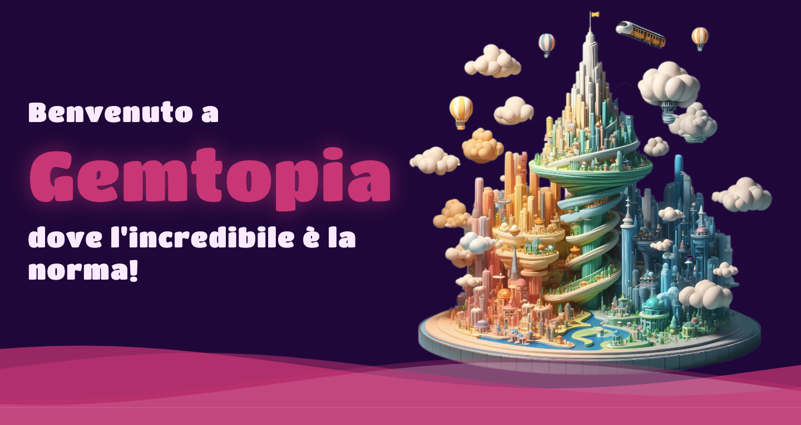

# PROGETTO GEMTOPIA - Gruppo: World Wide Web
**Progetto di Comunicazione Visiva e Design delle Interfacce AA2023/2024 @Unimib**

Gemtopia è una città delle meraviglie, dove l’insolito diventa la normalità: qui tutto è possibile, e ogni strada che si percorre è un viaggio attraverso le meraviglie più stravaganti e sorprendenti.
Al centro della città batte il cuore magico delle Gemme Meravigliose che sono al fonte di sostentamento di Gemtopia.
La città si divide in 4 quartieri: Dreamstrict è il quartiere del relax e dei sognatori. Intrepidaria è il quartiere dell’avventura e dei coraggiosi. Genius-hill è il quartiere della cultura e dei saggi. Cuddlehood è il quartiere delle coccole e dei romantici.

Tecnologie utilizzate:

- HTML5, CSS3, JavaScript
- Framework Bootstrap per il design e lo stile reattivi
- 

> Per avere un anteprima del progetto visitare il seguente link: https://m03v01.github.io/root_gemtopia/root/4_livegem.html

All'interno della cartella [**validation**](https://github.com/ ) sono presenti i file di validazione HTML e CSS del progetto.
